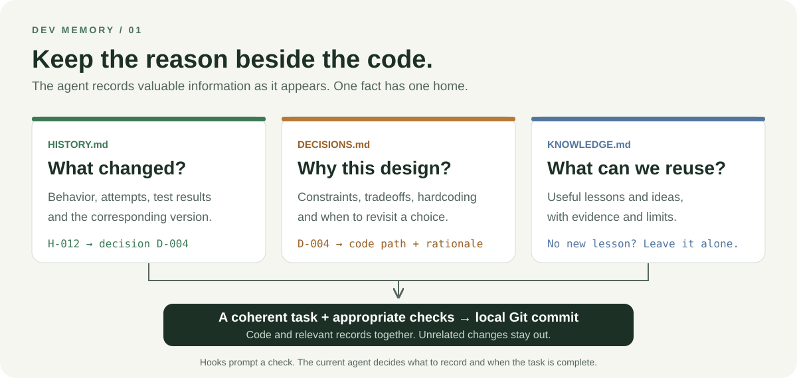
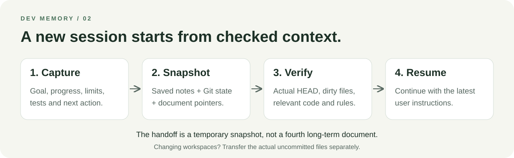

# Dev Memory · 开发记忆

**让代码之外的理由，也留在项目里。**

[English](README.en.md) · [完整对比](docs/comparison.zh-CN.md) · [Skill 规则](SKILL.md) · [MIT](LICENSE)

[](https://github.com/Jack15678/dev-memory/actions/workflows/tests.yml)

Agent 写代码很快，但过几天，你可能已经忘记：为什么暂时硬编码？为什么否决了另一个方案？哪些测试真的跑过？换个会话，又得从头解释。

Dev Memory 是一个优先适配 Codex 的开发记忆 Skill。它让当前 agent 按需维护三份 Markdown 文档，完成一个完整的小任务后把代码与记录一起提交到本地 Git，并在换会话时生成可核对的交接快照。



## 三份文档，各自回答一个问题

| 文件 | 回答什么 | 什么时候更新 |
|---|---|---|
| `HISTORY.md` | 改了什么、直接原因、试过什么、验证到哪、对应哪个版本？ | 有意义的修改、排查或验证形成时 |
| `DECISIONS.md` | 为什么这样设计？特殊处理和硬编码何时应该重审？ | 持续影响后续开发的选择形成或改变时 |
| `KNOWLEDGE.md` | 什么经验可以复用？证据和适用边界是什么？ | 确实有可复用发现时 |

同一事实只在一处完整维护，其他条目引用 H/D/K 编号。没有新信息就不写，不强制每轮更新三个文件。

## 安装与启用

需要能读写文件、执行命令的 agent，以及 **Python 3.10+**。版本保存使用已有 Git 仓库；脚本只依赖 Python 标准库。

先把仓库放进个人 Skill 目录。以下使用 Codex 当前文档中的 `~/.agents/skills`；若已有同名 Skill，请沿用原位置，避免重复安装。

**macOS / Linux**

```sh
mkdir -p ~/.agents/skills
git clone https://github.com/Jack15678/dev-memory.git ~/.agents/skills/dev-memory
```

**Windows PowerShell**

```powershell
New-Item -ItemType Directory -Force "$env:USERPROFILE/.agents/skills" | Out-Null
git clone https://github.com/Jack15678/dev-memory.git "$env:USERPROFILE/.agents/skills/dev-memory"
```

然后进入**你实际开发的项目**，对 agent 说：

```text
使用 $dev-memory 为当前项目启用开发记忆和 Codex Hooks。
```

初始化会创建缺少的文档、`.dev-memory.json`、AGENTS 维护约定，并合并项目内 `.codex/hooks.json`。项目默认采用「完整任务完成并验证后自动本地提交」策略。安装 Skill 本身不会批量启用其他项目。

在目标项目的 Codex CLI 中通过 `/hooks` 审阅并信任生成的配置。新建或改变的 Hook 需要宿主审阅；配置存在不等于已启用。若新 Skill 尚未显示，重启 Codex 刷新。依据：[官方 Skill 位置](https://learn.chatgpt.com/docs/build-skills)、[Hook 信任机制](https://learn.chatgpt.com/docs/hooks)。

### 按你的习惯使用

- **只记录、不自动提交**：告诉 agent「将当前项目 `.dev-memory.json` 的 `git_policy` 设为 `manual`，只维护记录，由我提交」。策略由 agent 遵守，脚本不执行提交。
- **首次启用不装 Hooks**：告诉 agent「使用 dev-memory，但初始化时选择 `--hooks none`」。仍可按 Skill 维护记录和交接；该参数不会删除已有 Hook。
- **本轮只讨论**：直接说「先讨论，不修改文件」。当前操作边界优先。

## 一个例子

以下为虚构示例，用于说明分工：

> 用户：首版上传上限固定为 20 MiB，先不做配置入口；有真实大文件需求再考虑。

Agent 将这个选择的来源、理由、代价、常量位置和重审条件写进 **D-004**。修改上传校验后，在 **H-012** 记录行为变化与实际边界测试，引用 D-004；本次没有通用经验，**KNOWLEDGE 保持不变**。

完整任务验证后，代码与记录一起提交。过一周问「为什么上限写死了」，agent 可以找到当时约束与出处。理由没有记录时，应明确说未知，不能从现有代码补编历史。

## 换会话，继续工作

```text
使用 $dev-memory 交接当前任务，我准备换个会话。
```



新会话中提供生成的快照路径：

```text
使用 $dev-memory 读取这个交接文件。先核对实际 HEAD 和工作区，再按当前授权继续。
```

交接快照包含已保存的任务摘要、Git 状态和文档入口，保存在本地忽略的 `.dev-memory/` 中。它是临时产物；换机器或 worktree 时，还需要单独转移实际未提交文件。任务尚未完成时不为交接强行提交。

## 自动化是怎样工作的

| 事件 | 作用 |
|---|---|
| `SessionStart` | 提供维护规则、文档及已有交接入口 |
| `UserPromptSubmit` | 提供本轮标识与记录检查回执方式 |
| `Stop` | 只读检查遗漏，必要时请求当前 agent 补查一轮 |
| `PreCompact` | 本轮已有允许记录的回执时，从已保存笔记和 Git 状态生成快照 |

**Hook 负责触发检查，当前 agent 负责判断和记录。** 没有额外记录 agent、模型 API 或数据库。主 agent 的记录与补查仍会消耗正常上下文和推理资源。

详细命令见 [运行说明](references/runtime.md)，交接步骤见 [handoff](references/handoff.md)。

## 适用范围与已知限制

适合使用 Git、经常换会话、想保留设计理由的个人开发者。核心文档流程不依赖项目语言；首次版本的自动 Hook 仅适配 Codex。

- 14 项运行时测试与独立修改提交、只读接手试用见 [H-001](docs/dev-memory/HISTORY.md#h-001)。CI 使用真实临时 Git 仓库，在 Windows 和 Linux 上运行协议检查。
- 当前实际会话已观察到上下文提示注入；完整压缩/停止生命周期及长期记录质量仍需持续验证。模拟事件通过不等于宿主全流程验证。
- macOS、其他 agent 的自动 Hook，以及多人/多 agent 同时修改同一份文档，尚未完成验证。
- 记录质量依赖 agent；没有自动语义审计、全文检索服务或稳定编号的并发分配器。
- 没有 Git 时可以保存记录，但不会自动初始化仓库。已有无关改动需要保留；本地提交策略不包含推送。

## 与现有方案的关系

工程记忆、决策记录和交接都有已有实践。Dev Memory 选择三份长期文档、按任务保存 Git 版本、临时交接快照这一组合。

我们阅读了 [OwnMem](https://github.com/grpcer/ownmem)、[Fractal Skills](https://github.com/yaukwan/fractal-skills)，并核对了 [LINUX DO 的 Codex 交接 Skill 说明](https://linux.do/t/topic/2230307/3)。各自的数据组织、自动维护方式、可借鉴能力和证据边界见 [完整对比](docs/comparison.zh-CN.md)。本仓库未复制这些项目的实现或模板。

## 开发与反馈

```sh
python -X utf8 -m unittest discover -s tests -v
```

欢迎通过 Issue 提供：使用的 agent 和系统、最小操作步骤、预期行为，以及经过脱敏的实际记录。特别希望了解哪些信息漏记了、哪些记录变成了噪声、接手时还需要补问什么。

MIT 许可。开发流程参考 [ADR](https://cognitect.com/blog/2011/11/15/documenting-architecture-decisions) 与 [跨会话任务实践](https://www.anthropic.com/engineering/effective-harnesses-for-long-running-agents)。
